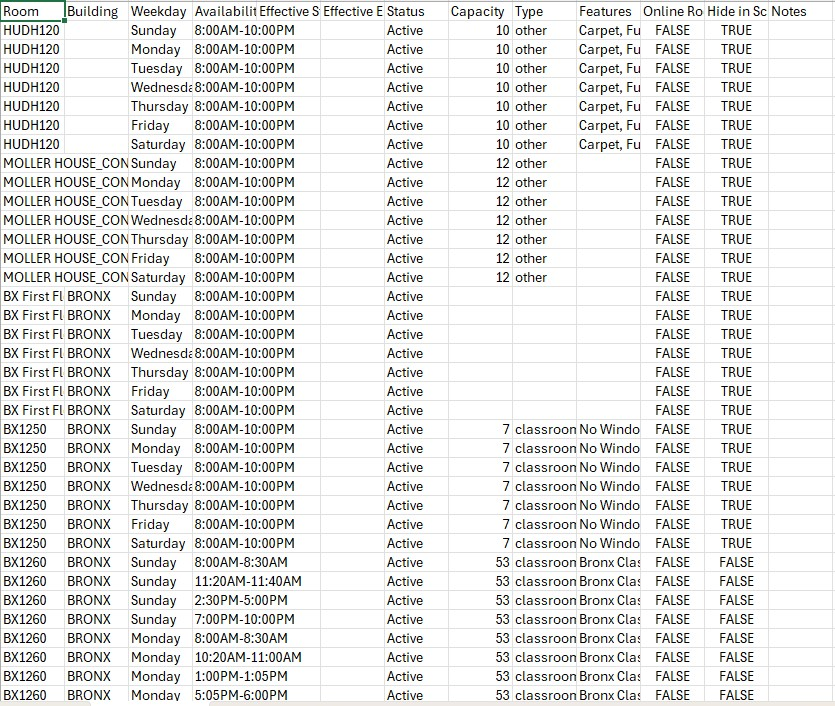
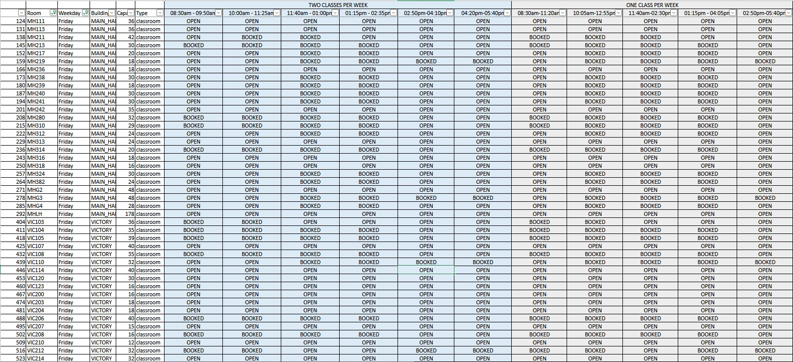

# Room Availability Report Optimization

## Overview

Academic scheduling teams frequently need to identify available classrooms for course scheduling, room reassignments, special events, and operational planning. While Coursedog provides a Room Availability Report, the exported report is primarily designed as a system extract and requires significant manual interpretation before it can support scheduling decisions.

To improve this process, I developed a Python-based automation solution that transforms raw Coursedog room availability exports into a structured scheduling report aligned with institutional meeting patterns.

The solution automatically cleans, validates, and standardizes room availability data while converting free-form availability windows into academic scheduling blocks that are immediately actionable for schedulers.

The result is a more intuitive, searchable, and operationally useful report that improves scheduling efficiency and reduces manual effort.

---

## Business Problem

Scheduling staff regularly need to answer questions such as:

- Which rooms are available Tuesday at 10:05 AM?
- Which classrooms can accommodate a new course section?
- Which rooms are available for special events?
- Which rooms can be used when a classroom becomes unavailable?

The original workflow required staff to:

1. Export the Room Availability Report from Coursedog
2. Review multiple room records
3. Interpret raw availability windows
4. Compare room availability against institutional meeting times
5. Manually determine whether a room was available

This process was time-consuming, repetitive, and difficult to scale during peak scheduling periods.

---

# Before & After Transformation

## Before: Raw Coursedog Availability Report

The original report contained room availability windows and room metadata but required schedulers to manually determine whether a room was available during standard academic meeting periods.

### Challenges

- Availability displayed as raw time ranges
- Difficult room searches
- Duplicate room records
- No alignment with academic scheduling blocks
- Limited scheduling decision support
- Increased manual effort

## Picture of Before



---

## After: Optimized Room Availability Report

The enhanced report automatically converts room availability windows into institutional scheduling blocks and presents room availability in a format that directly supports scheduling decisions.

Schedulers can immediately identify:

- Available rooms
- Available time blocks
- Building locations
- Room capacities
- Scheduling opportunities

without manually reviewing room availability windows.

## Picture of After



---

## Key Improvement

### Before

Question:

> Can MT413 support a class from 11:40 AM to 1:00 PM on Friday?

Required:

- Locate the room
- Review availability windows
- Compare times manually
- Determine overlap

### After

Question:

> Can MT413 support a class from 11:40 AM to 1:00 PM on Friday?

Answer:

- Directly visible through an OPEN / BOOKED indicator

The report transforms a manual scheduling task into an immediate decision-support process.

---

# Google PACE Framework

---

# 🟦 Plan

## Business Need

The scheduling office required a faster and more reliable method for identifying available classroom space.

The goal was to convert raw room availability exports into a scheduler-friendly report that could support course scheduling, room reassignment, and event planning decisions.

## Project Objectives

- Improve room availability visibility
- Reduce manual scheduling effort
- Standardize room availability information
- Increase report usability
- Support faster room assignment decisions
- Improve operational efficiency
- Create a repeatable automated workflow

## Success Criteria

The solution should:

- Reduce manual room analysis
- Improve report readability
- Align room availability with instructional meeting patterns
- Improve scheduling decision-making
- Produce a reusable reporting process

---

# 🟨 Analyze

## Review of the Original Report

The original report contained:

- Room information
- Building information
- Room capacity
- Room type
- Availability windows

Example:

```text
MT413 | Friday | 09:00AM - 05:00PM
```

Although accurate, the report did not directly indicate whether the room could support standard instructional meeting periods.

Schedulers still needed to manually compare availability windows against course meeting times.

---

## Identified Inefficiencies

| Challenge | Impact |
|------------|------------|
| Raw availability windows | Difficult interpretation |
| Duplicate room records | Additional review effort |
| Large room inventories | Reduced usability |
| No academic block alignment | Slower decision making |
| Manual room validation | Increased scheduling workload |
| Limited visibility into scheduling opportunities | Operational inefficiency |

---

## User Needs

The scheduling team required:

- Faster room searches
- Better room visibility
- Availability aligned to institutional meeting blocks
- Easier filtering and navigation
- Improved room assignment decision support

---

# 🟩 Construct

## Technical Solution

A Python-based automation workflow was developed to transform raw room availability exports into a scheduling-ready availability matrix.

The solution automatically:

- Cleans room inventory data
- Removes duplicates
- Validates scheduling rooms
- Parses availability windows
- Maps availability to instructional time blocks
- Generates an optimized room availability report

---

## Solution Architecture

```text
Coursedog Room Availability Export
                │
                ▼
        Data Cleaning
                │
                ▼
      Room Standardization
                │
                ▼
      Availability Parsing
                │
                ▼
 Academic Time Block Mapping
                │
                ▼
 Availability Matrix Creation
                │
                ▼
 Optimized Scheduling Report
```

---

## Technologies Used

| Technology | Purpose |
|------------|----------|
| Python | Automation |
| Pandas | Data transformation |
| Datetime | Time parsing and comparison |
| CSV Processing | Data ingestion and export |

---

## Technical Highlights

### Data Cleaning

The script standardizes room inventory data by:

- Removing duplicate room entries
- Standardizing room names
- Filtering rooms hidden from scheduling
- Validating room records

### Availability Parsing

Raw availability windows such as:

```text
09:00AM - 05:00PM
```

are converted into machine-readable time values.

This enables automated comparison against academic scheduling periods.

### Academic Time Block Mapping

The solution evaluates room availability against institutional meeting blocks.

Examples:

| Block | Time |
|---------|---------|
| S1 | 8:30 AM – 9:50 AM |
| S2 | 10:05 AM – 11:25 AM |
| S3 | 11:40 AM – 1:00 PM |
| S4 | 1:15 PM – 2:35 PM |
| S5 | 2:50 PM – 4:10 PM |
| S6 | 4:20 PM – 5:40 PM |

Additional extended meeting blocks are also supported.

### Availability Validation Logic

For each room and weekday combination, the script determines:

```text
Can the room fully support this instructional period?
```

The result becomes a simple OPEN / BOOKED availability matrix.

Example:

| Room | Weekday | S1 | S2 | S3 |
|--------|---------|----|----|----|
| MT413 | Friday | OPEN | OPEN | BOOKED |

This significantly improves report usability.

---

# 🟥 Execute

## Final Deliverable

The final output is an optimized room availability report that converts raw scheduling data into an operational decision-support tool.

Output:

```text
room_availability_slots.csv
```

---

## Results Achieved

### Operational Improvements

- Reduced manual room availability analysis
- Faster room assignment decisions
- Improved room reassignment workflows
- Increased visibility into classroom inventory
- Simplified event planning and room selection

### User Experience Improvements

- Easier navigation
- Improved filtering capabilities
- Faster room identification
- Better scheduling support

### Data Quality Improvements

- Removed duplicate room records
- Standardized room information
- Improved report consistency
- Increased reliability of scheduling data

---

## Business Impact

The optimized report transforms a manually intensive scheduling process into a streamlined operational workflow.

### Benefits

- Faster scheduling decisions
- Improved room utilization
- Reduced administrative effort
- Better support for course scheduling
- Improved event planning workflows
- Enhanced operational efficiency

### Example Impact

Instead of manually reviewing availability windows across hundreds of room records, schedulers can now immediately identify available rooms through a scheduling-ready availability matrix.

This allows staff to focus on decision-making rather than report interpretation.

---

## Skills Demonstrated

### Data Analytics

- Data Cleaning
- Data Transformation
- Process Analysis
- Operational Analytics

### Python Development

- Automation
- Data Processing
- Scheduling Logic
- Report Generation

### Business Analysis

- Process Improvement
- Workflow Optimization
- Stakeholder-Focused Solutions
- Operational Efficiency

### Higher Education Operations

- Academic Scheduling
- Room Utilization
- Resource Planning
- Scheduling Optimization

---

## Future Enhancements

Potential future improvements include:

### Interactive Dashboard

Develop a dashboard using:

- Plotly
- Dash
- Tableau
- Power BI

### Real-Time Availability Integration

Connect directly to scheduling systems for live room availability updates.

### Advanced Filtering

Add support for:

- Campus filtering
- Capacity filtering
- Room feature filtering
- Building filtering

### Room Recommendation Engine

Recommend optimal rooms based on:

- Availability
- Capacity
- Campus
- Room characteristics

### Scheduling Analytics

Develop room utilization metrics and occupancy analytics to support long-term scheduling decisions.

---

## Conclusion

The Room Availability Report Optimization project demonstrates how Python automation and data analytics can improve operational workflows within higher education.

By transforming a raw Coursedog export into a structured scheduling decision-support tool, the solution improves room visibility, reduces manual effort, and enhances scheduling efficiency.

This project highlights the practical application of data analytics, automation, and process improvement to solve a real-world operational challenge.
